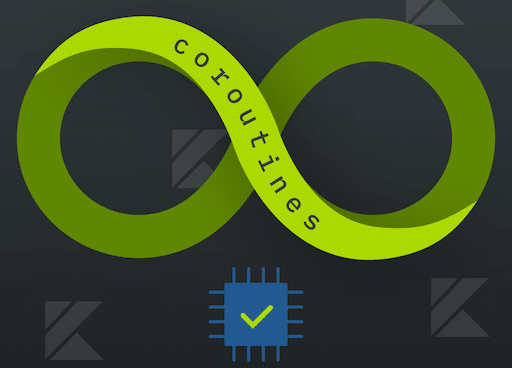

# A Bottom-Up View of Kotlin Coroutines



[](https://github.com/oldratlee/kotlin-coroutines-bottom-up/actions/workflows/ci.yaml)
[](https://openjdk.java.net/)
[](https://www.apache.org/licenses/LICENSE-2.0.html)

Complete runnable demo code of the article [A Bottom-Up View of Kotlin Coroutines](https://www.infoq.com/articles/kotlin-coroutines-bottom-up/) - _Garth Gilmour_ / _Eamonn Boyle_，2020-01-11.

PS: My [Chinese translation](https://github.com/oldratlee/translations/blob/master/kotlin-coroutines-bottom-up/README.md) of this article.

## Pre requirements

- `JDK 11+`
- `JDK` bundle with `JavaFX`

> The simple way to install required `JDK` is using [**_`SDKMAN`_**](https://sdkman.io/install):
>
> ```ruby
> sdk install java 11.0.14.fx-zulu
> ```

## Run Server

```sh
./mvnw compile -pl server exec:java -Dexec.mainClass=com.oldratlee.demo.koroutines_bottom_up.server.ServerMainKt
```

## Run Client

```sh
./mvnw compile -pl client exec:java -Dexec.mainClass=com.oldratlee.demo.koroutines_bottom_up.client.MyAppKt
```
